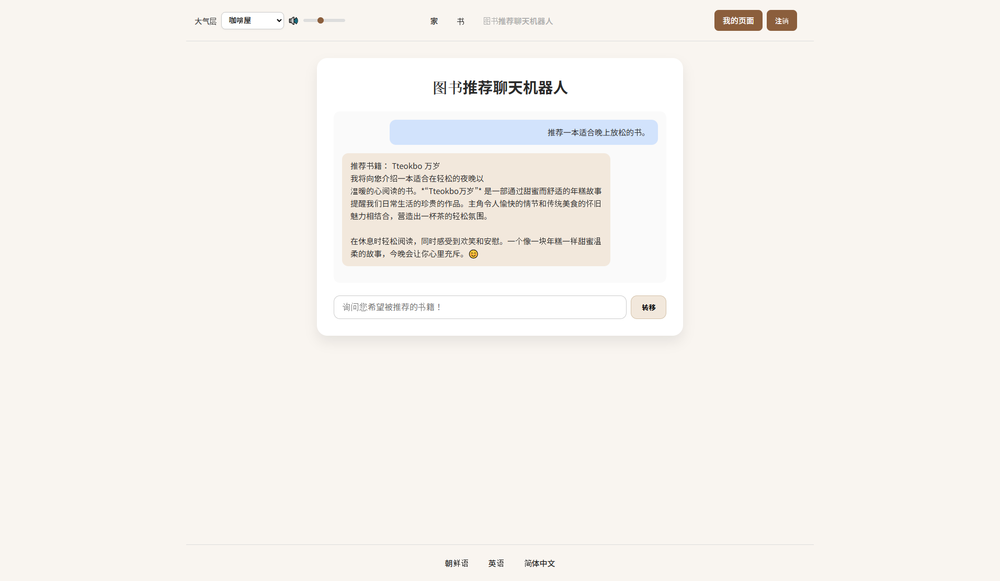
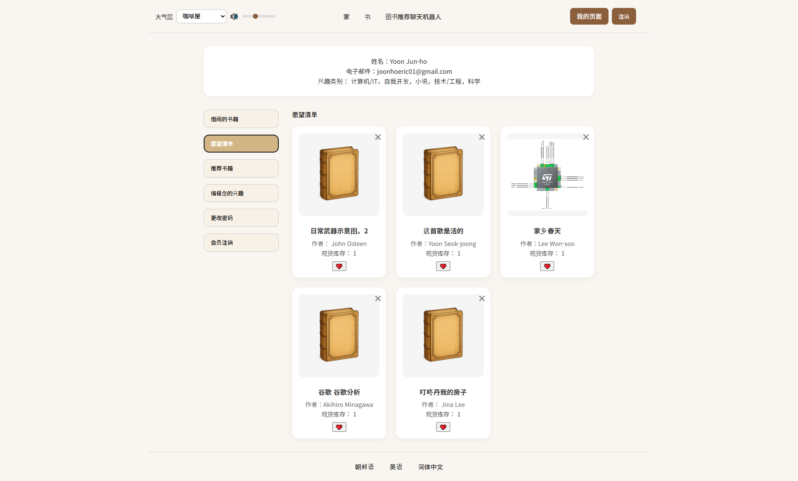
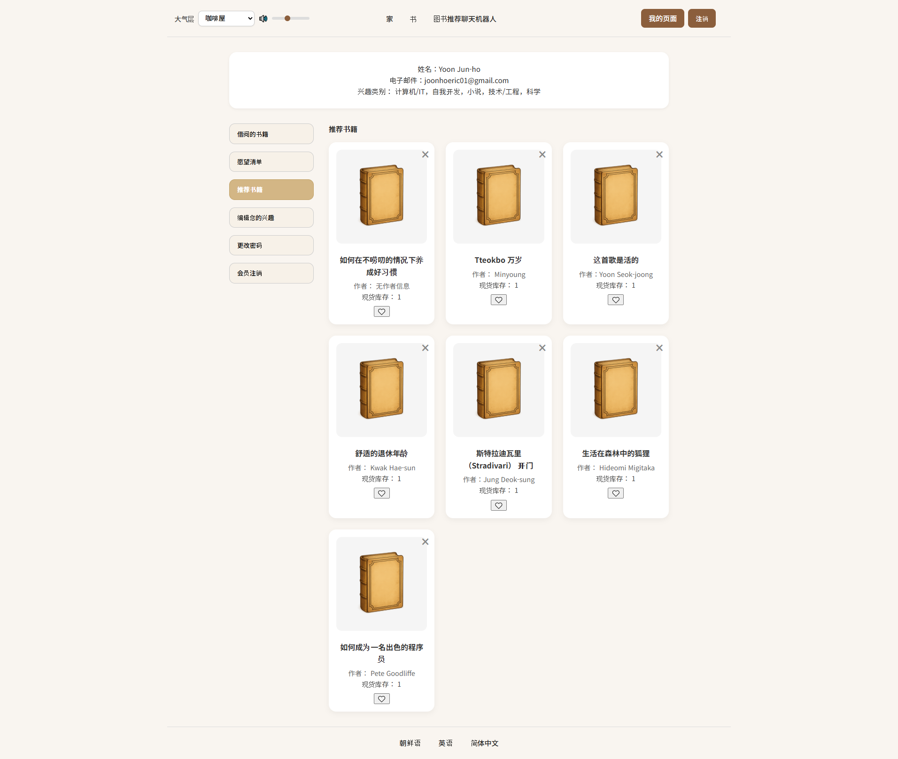

# AI 기반 도서 추천 시스템 (AI-Powered Book Recommendation System)
# AI 기반 도서 추천 시스템 (AI-Powered Book Recommendation System)
> Spring Boot + Vue3 + DeepSeek API를 활용한 감정 기반 개인화 도서 추천 서비스

[](LICENSE)
[](https://spring.io/projects/spring-boot)
[](https://vuejs.org/)

## 프로젝트 개요

사용자의 **감정과 상황**에 맞는 도서를 추천하는 AI 기반 온라인 서점 시스템입니다.  
중국 북경과학기술대학교 졸업 프로젝트로 개발했으며, 자연어 처리(NLP)와 벡터 임베딩 기술을 활용해 **"우울할 때 읽고 싶은 책"** 같은 개방형 질문에 대응하는 개인화 추천을 구현했습니다.

기존 온라인 서점이 키워드 검색과 인기 순위 중심이었다면, 본 시스템은 **사용자의 감정 상태, 독서 목적, 상황**을 이해하고 이에 맞는 책을 제안합니다.

## 주요 기능

### 1. AI 자동 도서 요약
- **DeepSeek Reasoner API**를 활용해 도서 설명을 3줄로 자동 압축
- 관리자의 수작업 없이 **멀티스레드 배치 처리**로 대량 요약 생성
- 처리 시간: **611초 → 70초** (약 8.7배 개선)

### 2. 감정 기반 자연어 추천
- **"시험 기간에 읽으면 좋을 책 추천해줘"** 같은 자연어 입력 지원
- **DeepSeek-V3 모델**로 사용자 의도 분석 (감정, 상황, 주제 추출)
- **e5-large-v2 임베딩 모델**로 의미 기반 유사도 계산
- 벡터 유사도 + 키워드 매칭 + 사용자 관심사 가중치 결합한 **하이브리드 추천**

### 3. 콜드스타트 문제 해결
- 신규 사용자 가입 시 **최소 3개 관심 카테고리 선택**
- 초기 사용자도 관심사 기반 추천 가능

### 4. 완전한 온라인 서점 기능
- ISBN 기반 **대량 도서 자동 등록** (Google Books API 연동)
- 도서 검색, 분류별 탐색, 가격/재고 관리
- 도서 **수집(위시리스트)** 및 **대출/반납 기능**
- 추천 이력 조회

### 5. 몰입형 사용자 경험
- 배경 음악(BGM) 선택 기능 (카페, 도서관, 자연 등)
- Vue3 기반 반응형 SPA 인터페이스

## 기술 스택

### Backend
- **Spring Boot 3.0** - REST API 서버
- **JPA/Hibernate** - ORM, MySQL 연동
- **JWT** - 사용자 인증
- **Google Books API** - 도서 메타데이터 수집
- **Guava RateLimiter** - API 호출 제어

### Frontend
- **Vue 3** - SPA 프레임워크
- **Axios** - HTTP 통신
- **Pinia** - 상태 관리

### AI/ML
- **DeepSeek API** (deepseek-v3, deepseek-reasoner) - 의도 분석 및 요약
- **PyTorch** - 벡터 연산
- **SentenceTransformer (e5-large-v2)** - 텍스트 임베딩
- **Flask** - Python AI 서비스 서버

### Database
- **MySQL 8.0** - 관계형 데이터베이스

### Optimization
- **멀티스레드 처리** (ExecutorService)
- **GPU 가속** (torch.cuda)
- **벡터 캐싱** - 중복 계산 방지

| 항목 | 최적화 전 | 최적화 후 | 개선율 |
|------|-----------|-----------|--------|
| AI 요약 생성 (16권) | 611초 | 70초 | **8.7배** |
| 추천 응답 시간 | 38초 | 16.7초 | **2.3배** |
| 임베딩 계산 | 117ms | 37ms | **3.2배** |

**최적화 전략:**
- 멀티스레드 배치 처리 (최대 40 스레드)
- RateLimiter로 API 호출 제어 (초당 4회)
- GPU 가속 벡터 연산
- 비동기 처리 (asyncio)
- 벡터 캐싱 및 사전 계산

## 시스템 아키텍처
```
┌─────────────┐
│   Vue3 SPA  │  ← 사용자 인터페이스
└──────┬──────┘
       │ REST API (Axios)
┌──────▼──────────────────┐
│  Spring Boot Backend    │  ← 비즈니스 로직, JWT 인증
│  (User/Book/Auth)       │
└──────┬──────────────────┘
       │
       ├─────→ MySQL (사용자, 도서, 추천 기록)
       │
       └─────→ Flask AI Service (Python)
                  │
                  ├─→ DeepSeek API (요약/의도 분석)
                  └─→ e5-large-v2 (벡터 임베딩)
```

## 문서

- **[중국어 원본 졸업논문 (PDF)](./docs/graduation_thesis_CN.pdf)** (60페이지)
- **[한국어 프로젝트 요약](./docs/project_summary_KR.md)** (핵심 내용 정리)

## 🖼 주요 화면

### 도서 추천 화면


### AI 요약 생성 결과


### 수집 및 추천 이력


## 주요 성과

### 기술적 성과
- **LLM API 비교 분석**: GPT-4, Google PaLM 2, DeepSeek 비용/성능 비교
- **하이브리드 추천 알고리즘 설계**: 협업 필터링 + 콘텐츠 기반 + 벡터 임베딩
- **대규모 데이터 처리 최적화**: 멀티스레드, GPU 가속, 캐싱 전략
- **전체 시스템 단독 개발**: 기획, 백엔드, 프론트엔드, AI 알고리즘, DB 설계

### 학술적 성과
- 북경과학기술대학교 졸업논문 심사 통과 예정 (2025년 6월)
- 연속 장학금 수혜 (2019-2025, 전액 장학금)

## 배운 점

1. **AI API 선택 전략**: 비용 효율성과 성능을 동시에 고려한 기술 선택
   - GPT-4: 토큰당 $0.03, 성능 우수하나 비용 높음
   - DeepSeek: GPT-4 대비 1/10 비용, 한국어/중국어 지원 우수
   
2. **성능 최적화**: 병목 지점 분석 및 해결
   - API 호출 속도 제어 (Rate Limiting)
   - 멀티스레드 처리로 대량 작업 가속
   - GPU 가속으로 벡터 연산 최적화

3. **전체 시스템 설계**: 모듈화와 확장성 고려
   - 프론트엔드/백엔드 분리
   - AI 서비스 독립 모듈화
   - RESTful API 설계 원칙 준수

4. **사용자 경험 설계**: 기술이 아닌 사용자 중심 사고
   - "멈춘 것처럼 보이지 않게" (로딩 스켈레톤, 진행 상태)
   - 자연어 입력으로 진입 장벽 낮춤
   - 몰입형 인터페이스 (BGM, 부드러운 전환)

## 개발 정보

- **개발자**: 윤준호 (Yoon Junho)
- **개발 기간**: 2024.11 ~ 2025.05 (6개월)
- **역할**: 단독 개발 (기획, 설계, 구현, 테스트)
- **학교**: 북경과학기술대학교 (Beijing University of Science and Technology)
- **전공**: 컴퓨터공학과 (Computer Science and Technology)


## Contact

- Email: joonhoeric01@gmail.com
- GitHub: [@Luriar](https://github.com/Luriar)
  
## License

This project is licensed under the MIT License - see the [LICENSE](LICENSE) file for details.

---
**※ 본 프로젝트는 학술 목적으로 개발되었으며, 상업적 사용을 목적으로 하지 않습니다.**
